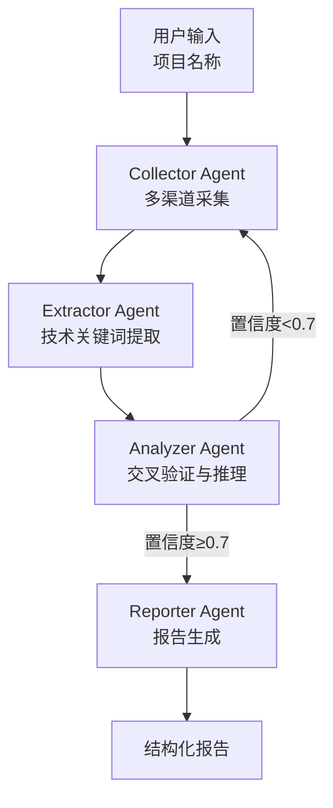

# Bidding Deep Miner — 设计文档

## 动机

在招投标项目中，经常遇到项目名称**不直接暴露具体工艺**的情况。例如：

> "某市污水处理厂扩建工程项目"

这个名称只说了是"污水处理厂扩建"，但到底用 A²O、MBR、SBR 还是氧化沟？项目名称没有说。

传统做法是人工打开招标公告全文、翻技术方案、查环评报告——耗时且容易遗漏关键信息。

Bidding Deep Miner 的目标是**自动化这个"信息挖掘→交叉验证→工艺推断"的过程**。

## 设计原则

1. **多源互补** — 不依赖单一数据源，招投标平台 + 通用搜索 + 学术搜索互为补充
2. **证据加权** — 不同来源按可信度分级，招标文件原文权重 > 新闻报道
3. **迭代深化** — 置信度不足时自动发起新一轮搜索（用新发现的关键词）
4. **结论可溯源** — 每条结论都附证据来源，不搞"黑盒推理"

## 架构



## 与 deep-research-agent 的关系

`bidding-deep-miner` 是 `deep-research-agent` 的**垂直领域应用**：

| 层面 | deep-research-agent | bidding-deep-miner |
|------|-------------------|-------------------|
| 定位 | 通用深度研究框架 | 招投标垂直领域挖掘 |
| 数据源 | 搜索 + 学术 + 通用 | 招投标平台为主 + 其他 |
| Agent | Supervisor → Researcher → Analyzer → Writer → Reviewer | Collector → Extractor → Analyzer → Reporter |
| 特色 | 审核循环、多轮迭代 | 证据分级、工艺推理、置信度评估 |
| LLM 调用 | 每个 Agent 独立调用 | 同上 |

## 证据推理逻辑

```
多条证据 → 各自提取技术关键词 → 统计频率 + 加权 → 推断工艺

例:
  来源A (P1 - 招标文件): "采用 A²O + 深度处理工艺"
  来源B (P3 - 中标公告): "A²O 生物池"
  来源C (P4 - 新闻报道): "采用先进污水处理工艺"

→ A²O 出现 2 次 (P1 + P3) → 置信度高
→ 推断工艺: A²O
```

## 未来扩展

- [ ] 接入更多垂直数据源（环评公示平台、企业信用信息公示系统）
- [ ] 自动下载招标文件 PDF 并解析正文
- [ ] 工艺知识库（常见工艺的特征参数对照表）
- [ ] 相似项目推荐（根据工艺关键词匹配历史项目）
- [ ] 可视化证据链（Mermaid 图表展示证据来源和推理路径）
