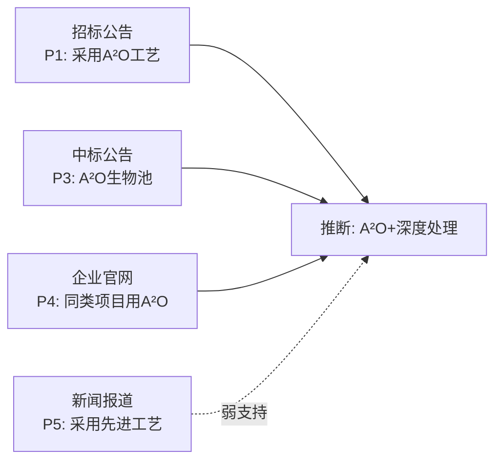

# 进度报告：挖掘进展汇报

当挖掘产生值得分享的内容时，创建一份进展报告——不是状态摘要，而是讲述挖掘故事的展示。

## 何时报告

你来判断何时进展足够有意义。考虑在这些时候报告：

- 首次搜索完成，发现了关键线索
- 提取到 P1/P2 级别的直接证据
- 分析阶段得出了置信度 ≥ 0.7 的推断
- 外环综合后发现了重要的证据模式
- 搜索策略需要大幅调整时（请求用户确认）
- 生成最终报告时

最低频率：每个 /loop tick 最多一次。最高频率：每当有用户会感兴趣的内容。

## 好的进展报告包含什么

1. **讲一个故事**: 我们找了什么、怎么找的、找到了什么、意味着什么
2. **展示证据**: 列出关键证据项（来源、内容、可信度），不只是描述
3. **选择性呈现**: 突出重要发现，不要穷举每条搜索
4. **说明方向**: 接下来做什么、为什么

## 推荐章节

### 1. 项目概述
- 项目名称、规模、领域
- 搜索策略摘要（用了哪些渠道）

### 2. 搜索进展
- 已搜索的平台和关键词
- 搜索结果统计（找到多少条相关结果）

### 3. 关键发现
- 最重要的 2-3 条证据，附来源和可信度
- 为什么这些证据重要

### 4. 工艺推断
- 当前最可能的工艺方案
- 置信度评分和依据
- 排除的方案及原因

### 5. 证据链可视化

用 Mermaid 展示证据之间的关系：

### 6. 下一步
- 还需要搜索什么
- 哪些信息需要用户确认

## 报告格式

- 优先使用 Markdown 格式，同时包含 Mermaid 图表
- 如果用户需要 PDF，用 Python（markdown + weasyprint 或类似方案）转换
- 报告放在 `reports/` 目录下
